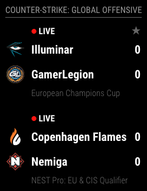

# MMM-HLTV

> MagicMirror² module which will show CS:GO matches provided by HLTV

<a href="https://www.buymeacoffee.com/maartenpaauw" target="_blank"></a>

This is a module for the [MagicMirror²](https://github.com/MichMich/MagicMirror/) which displays the current and upcoming Counter-Strike: Global Offensive matches.



## Installation

To install the module, use your terminal to:

1. Navigate to your MagicMirror's modules folder. If you are using the default installation directory, use the command: `cd ~/MagicMirror/modules`.
2. Copy the module to your computer by executing the following command: `git clone https://github.com/maartenpaauw/MMM-HLTV.git`.
3. Navigate to the MMM-HLTV module directory with `cd MMM-HLTV`.
4. Execute `yarn install` to install the node dependencies.

## Using the module

To use this module, add the following configuration block to the modules array in the `config/config.js` file:
```js
var config = {
    modules: [
        {
            module: 'MMM-HLTV',
            header: "Counter-Strike: Global Offensive",
            config: {
                // See below for configurable options
            },
        },
    ],
}
```

## Configuration options

| Option           | Description                                                                                                               |
| ---------------- | ------------------------------------------------------------------------------------------------------------------------- |
| `updateInterval` | *Optional* The update interval in milliseconds <br><br>**Type:** `int` <br>**Default:** 60000 (1 minute)                  |
| `amount`         | *Optional* The amount of matches to show <br><br>**Type:** `int` <br>**Default:** 5                                       |
| `stars`          | *Optional* The minimum number of stars a match must have <br><br>**Type:** `int` <br>**Default:** 0                       |
| `teams`          | *Optional* Only teams (IDs) that are included in this list may be displayed <br><br>**Type:** `int[]` <br>**Default:** [] |
| `preferWhite`    | *Optional* Whether the module may use colors <br><br>**Type:** `bool` <br>**Default:** false                              |
| `template`       | *Optional* Which template to use (only `strafe` is available) <br><br>**Type:** `string` <br>**Default:** strafe          |
| `showLogos`      | *Optional* whether the logos of the teams may be displayed <br><br>**Type:** `bool` <br>**Default:** true                 |

## Built With

- [HLTV](https://github.com/gigobyte/HLTV) - HLTV API wrapper.

## Authors

- **Maarten Paauw** - *Initial work* - [maartenpaauw](https://github.com/maartenpaauw)

## License

This project is licensed under the GNU General Public License v3.0 - see the [LICENSE.md](LICENSE.md) file for details
